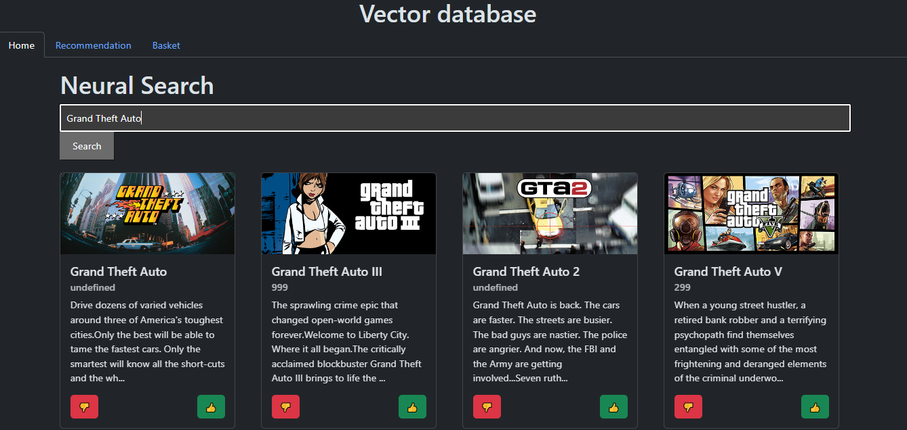

# Solid PODs
by Henriques Amaral Guilherme Filipe, Schneider Bastien, Salamin Alexandre


## Description of the project
This project focuses on exploring the concept of solid PODs through a simple concrete example. In this project, we are leveraging [Solid Community](https://solidcommunity.net/), a solution made for the creation of simple applications and allowing for a more efficient PODs implementation.

For this example, we are developing on and expending our [first project](https://gitlab.com/Hypnot/vector-database) which was a video games platform that allowed the user to select the games they like and the ones they dislike to generate, based on that, pertinent recommendations on the home page. That project was leveraging a [vector database](documents/vector.md) to manage the recommendations. Here, the idea is to add a login option on this solution and keep the likes/dislikes in memory using solid PODs (through [Solid Community](https://solidcommunity.net/)).

We will mainly focus on the explanation of the concept of solid PODs and their potential use.

You will find the complete solution of our project with a step-by-step installation bellow.

## What are Solid PODs?
Solid is a new technology developed by Sir Time Berners-Lee, the creator of the World Wide Web to re-think the way data are handled on the web. Today, users have different pieces of personal data linked to each website/application they go on. They main idea of Solid is to centralize this data into personal PODs. The users are then able to choose which part of their data they want to share with which website/application.

This has three main goals :
- Simplifying the process of handling our data, that is essential on today's internet (For example : changing an address would only require being modified in one place. All the website/application would then automatically update to the new address)
- Helping users regain control of their privacy (Users can choose precisely what they want to share. Ensuring easily and efficiently that no data they don't want to share are public)
- Security (Having all important data stored in one secure place minimizes the risk of leak or misuse. Furthermore, Solid PODs are made to prioritize security, employing robust encryption and authentication mechanisms to protect users' data from unauthorized access and cyber threats)

It is a solution for the future that, if adopted, would induce a paradigm shift in personnal data. But it unfortunately seems unlikely as data selling is a very lucrative business today

## Requirement
- [Docker Desktop](https://www.docker.com/products/docker-desktop/)
- [Python](https://www.python.org/downloads/)
- [pip](https://www.geeksforgeeks.org/how-to-install-pip-on-windows/)
- [NodeJS](https://nodejs.org/en/download)
- IDE (Like [VS code](https://code.visualstudio.com/download), [Intellij](https://www.jetbrains.com/idea/download/section=windows),...)

## Setup
### Installing everything
1. Have all the requirements installed
2. Clone the project
3. Install the Inrupt dependency (used to manage pods)
```npm install @inrupt/solid-client @inrupt/solid-client-authn-browser @inrupt/vocab-common-rdf @inrupt/vocab-solid```
4. Install the Webpack dependency (npm-leveraging framework)
```npm install webpack webpack-cli webpack-dev-server css-loader style-loader --save-dev```
5. Install the needed packages for Python via the [requirements.txt](requirements.txt)
```pip install -r requirements.txt```
6. Install the Qdrant docker (via the command prompt for example)
```docker pull qdrant/qdrant```
7. Run the docker
```docker run -p 6333:6333 qdrant/qdrant```

### Preparation and uploading of the dataset/collection (pulled from the last project)
You can create your own dataset manually by following this [guide](https://qdrant.tech/documentation/quick-start/#create-a-collection), but for our project we decided to find a dataset online already made, for exemple, in [kaggle](https://www.kaggle.com/datasets)

The dataset we chose is the [steam dataset](https://www.kaggle.com/datasets/deepann/80000-steam-games-dataset?resource=download) and it gives us a .csv and a .json. We extract the .json and put it in ``Data/RawData`` then we run the code [datasetPreparation.py](dist/Code/datasetPreparation.py) (Make sure to do the necessary path correction).

Next, we need to upload the dataset in the vector database and, to do that, we run the code [uploadToDb.py](dist/Code/uploadToDb.py).

Once the code is finally done, we can check if our database exist on the [Qdrant UI](http://localhost:6333/dashboard#/collections) and, as we can see, our dataset is complete.
 

### Starting the solution
1. Make sure the Docker is still running. If it's not, run
```docker run -p 6333:6333 qdrant/qdrant```
2. Run [service.py](Code/service.py) and let it run behind
3. Start the npm project
```npm run start```
4. You can now access the [application](http://localhost:8080/)

## The web application
Once everything is running, you will be able to access your [web application](http://localhost:8080/) at localhost:8080. There, you will have to login to [Solid Community](https://solidcommunity.net/) (or register if it is your first time) via the login button on the top right of the website.

Only once logged-in, will you be able to navigate the video games dataset:


On the homepage, you can search a game title, like the game, dislike it, access to the Recommendation page and the Basket page.

When you like or dislike a game, it will enter to the Basket page and when you access the Recommendation page, it will show you games based on the liked games, the disliked games and the games that are close to the disliked games will be filthered from the recommendation page. 
You can like/dislike a game from the recommendation page and it will added to the Basket page then remove from the recommendation page.

You can access to your liked/disliked games in the Basket page. You can remove them if necessary. 

If we go back to the Home page and try to search a game, for exemple, Grand Theft Auto, we have this results : 

As we can see, our research get the closest game base on the vector and the search.

And everything you are doing is saved on your POD so you will normally have the exact same recomendation home page the next time you run the project.

## Error handling
placeholder