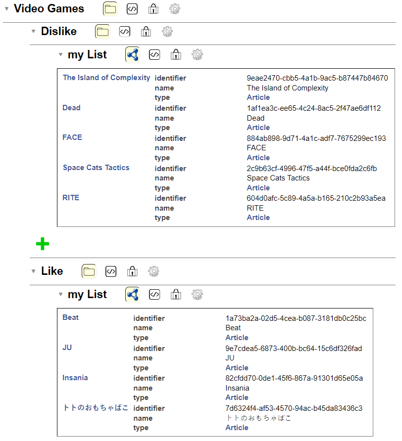

# Solid PODs
by Henriques Amaral Guilherme Filipe, Schneider Bastien and Salamin Alexandre

## Table of Contents
* [Description of the Project](#description-of-the-project)
* [What are Solid PODs?](#what-are-solid-pods)
* [Requirements](#requirement)
* [Setup](#setup)
  * [Installing Everything](#installing-everything)
  * [Preparation and Upload of the Dataset/Collection (pulled from the last project)](#preparation-and-upload-of-the-datasetcollection-pulled-from-the-last-project)
  * [Starting the Solution](#starting-the-solution)
* [The Web Application](#the-web-application)

## Description of the Project
This project focuses on exploring the concept of solid PODs through a simple concrete example. In this project, we are 
leveraging [Solid Community](https://solidcommunity.net/), a solution made for the creation of simple applications and allowing for a more 
efficient PODs implementation.

For this example, we are developing on and expending our [first project](https://gitlab.com/Hypnot/vector-database) which was a video games platform that 
allowed the user to select the games they like and the ones they dislike to generate, based on that, pertinent 
recommendations on the home page. That project was leveraging a [vector database](documents/vector.md) to manage the recommendations. 
Here, the idea is to add a login option on this solution and keep the likes/dislikes in memory using solid PODs 
(through [Solid Community](https://solidcommunity.net/)).

We will mainly focus on the explanation of the concept of solid PODs and their potential use.

You will find the complete solution of our project with a step-by-step installation bellow.

## What are Solid PODs?
Solid is a new technology developed by Sir Time Berners-Lee, the creator of the World Wide Web to re-think the way data 
are handled on the web. Today, users have different pieces of personal data linked to each website/application they go 
on. They main idea of Solid is to centralize this data into personal PODs. A POD is a data container that supports REST 
calls and identification through an identity server and an internal Access Control List. They are primarily made to host 
[RDF-modeled](https://en.wikipedia.org/wiki/Resource_Description_Framework) pieces of data but can also host non-RDF 
ones. Finally, a POD can be either self-hosted or server-hosted (in this project the PODs used are hosted on
[Solid Community](https://solidcommunity.net/)).

So, the users are able to connect to their POD through the identification server and choose which part of their data
they want to share with which website/application.

This has three main goals :
- Simplifying the process of handling our data, that is essential on today's internet (For example : changing an address would only require being modified in one place. All the website/application would then automatically update to the new address)
- Helping users regain control of their privacy (Users can choose precisely what they want to share. Ensuring easily and efficiently that no data they don't want to share are public)
- Security (Having all important data stored in one secure place minimizes the risk of leak or misuse. Furthermore, Solid PODs are made to prioritize security, employing robust encryption and authentication mechanisms to protect users' data from unauthorized access and cyber threats)

It is a solution for the future that, if adopted, would induce a paradigm shift in personal data. But its adoption 
unfortunately seems unlikely as data selling is a very lucrative business today.

## Requirement
- [Docker Desktop](https://www.docker.com/products/docker-desktop/)
- [Python](https://www.python.org/downloads/)
- [pip](https://www.geeksforgeeks.org/how-to-install-pip-on-windows/)
- [NodeJS](https://nodejs.org/en/download)
- IDE (Like [VS code](https://code.visualstudio.com/download), [Intellij](https://www.jetbrains.com/idea/download/section=windows),...)

## Setup
### Installing everything
1. Have all the requirements installed
2. Clone the project
3. Install all the npm dependencies defined in [package.json](package.json)
```npm install```
5. Build the npm project
```npm run build```
6. Install the needed packages for Python via the [requirements.txt](requirements.txt)
```pip install -r requirements.txt```
7. Install the Qdrant docker (via the command prompt for example)
```docker pull qdrant/qdrant```
8. Run the docker
```docker run -p 6333:6333 qdrant/qdrant```

### Preparation and Upload of the Dataset/Collection (pulled from the last project)
You can create your own dataset manually by following this 
[guide](https://qdrant.tech/documentation/quick-start/#create-a-collection), but for our project we decided to find a 
dataset online already made, for exemple, in [kaggle](https://www.kaggle.com/datasets)

The dataset we chose is the 
[steam dataset](https://www.kaggle.com/datasets/deepann/80000-steam-games-dataset?resource=download), and it gives us 
a .csv and a .json. We extract the .json and put it in ``Data/RawData`` then we run the code 
[datasetPreparation.py](backend/datasetPreparation.py) (Make sure to do the necessary path correction).

Next, we need to upload the dataset in the vector database and, to do that, we run the code 
[uploadToDb.py](backend/uploadToDb.py).

Once the code is finally done, we can check if our database exist on the 
[Qdrant UI](http://localhost:6333/dashboard#/collections) and, as we can see, our dataset is complete.
 

### Starting the solution
1. Make sure the Docker is still running. If it's not, run
```docker run -p 6333:6333 qdrant/qdrant```
2. Run [service.py](backend/service.py) and let it run behind
3. Start the npm project
```npm run start```
4. You can now access the [application](http://localhost:5173/)

## The web application
Once everything is running, you will be able to access your [web application](http://localhost:5173/) at localhost:5173. 
There, you will have to log in to [Solid Community](https://solidcommunity.net/) (or register if it is your first time) 
via the login button on the top right of the website.


Only once logged-in, you will be able to display the video games' dataset by clicking the "Load Games" button.


On this page, you can either like or dislike any of the games. The information will be transferred to your POD and 
reloaded each new loading of this page. You can view that by accessing your personal POD at
"username.solidcommunity.net" in the "Your storage section". You will see that a new categories has been added named 
"Video Games" with inside a list of your liked and your disliked games, which you can manage entirely here. (As you 
can see, we used the "Article" RDF to define them)


The liked and disliked games will then be loaded in the web page on each reload.